# Tutorial Otto Starter com Arduino Nano, HM-10 BLE e Otto Web App

## 1. Objetivo

Este tutorial mostra como montar, programar, calibrar, conectar e operar um robô Otto Starter com:

- Arduino Nano com ATmega328P;
- quatro servomotores;
- módulo Bluetooth Low Energy HM-10 ou compatível;
- sensor ultrassônico HC-SR04;
- buzzer;
- [Otto Web App Control](https://ottodiy.github.io/OttoWebAppControl/).

Para as atividades, o firmware usa a pinagem do exemplo oficial da OttoDIYLib:

```cpp
#define LeftLeg 2
#define RightLeg 3
#define LeftFoot 4
#define RightFoot 5
#define Buzzer 13
#define Trigger 8
#define Echo 9
```

Com essas definições, a inicialização dos servos e do buzzer equivale a:

```cpp
ottobot.init(2, 3, 4, 5, true, 13);
```

Os números `2, 3, 4, 5` representam, nessa ordem, os pinos da perna esquerda, perna direita, pé esquerdo e pé direito. O `13` é o pino do buzzer. O parâmetro `true` manda a biblioteca carregar da EEPROM os ajustes de calibração já gravados.

> **Importante:** esquerda e direita são definidas do ponto de vista do próprio robô, olhando para a frente.

## 2. O que já está definido e o que precisa ser conferido

Esta organização segue os exemplos oficiais do Otto Starter, montando o hardware exatamente conforme a tabela; os modos **Avoid** e **Jedi** somente funcionarão se o ultrassônico também estiver ligado aos pinos indicados.

| Componente | Função | Pino do Nano |
|---|---|---:|
| Servo 1 | Perna esquerda | D2 |
| Servo 2 | Perna direita | D3 |
| Servo 3 | Pé esquerdo | D4 |
| Servo 4 | Pé direito | D5 |
| HC-SR04 | TRIG | D8 |
| HC-SR04 | ECHO | D9 |
| HM-10 | Nano recebe do BLE | D10 |
| HM-10 | Nano transmite ao BLE | D11 |
| Buzzer | Sinal | D13 |

O código somente poderá controlar o que estiver conectado nesses mesmos pinos. Não basta alterar o nome de uma constante: a ligação física e a constante correspondente precisam coincidir.

## 3. Como o sistema funciona

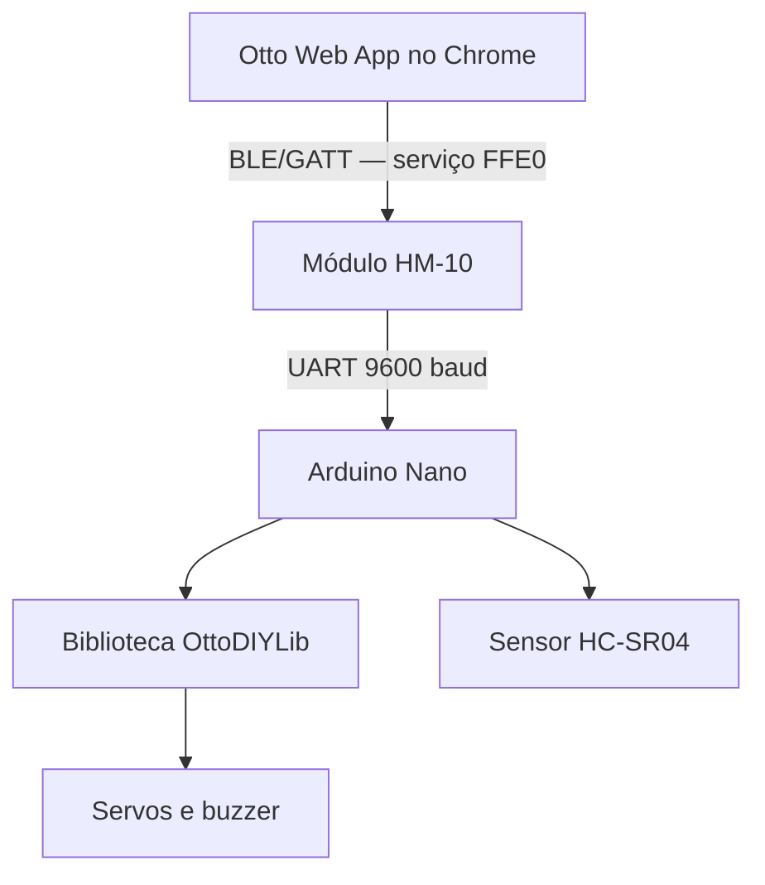

Há duas comunicações diferentes:

1. **Web App ↔ HM-10:** comunicação Bluetooth Low Energy por serviços e características GATT.
2. **HM-10 ↔ Nano:** comunicação serial UART a 9600 baud pelos pinos D10 e D11.

O HM-10 funciona como uma ponte. Ele recebe um texto do navegador por BLE e o entrega ao Nano pela UART. Por exemplo:

```text
forward 2\n
```

O Nano interpreta o texto, seleciona o movimento e chama a função correspondente da biblioteca Otto.

## 4. Materiais necessários

- Arduino Nano ATmega328P;
- cabo USB de dados;
- quatro servomotores compatíveis com o Otto;
- peças impressas: corpo, cabeça, duas pernas e dois pés;
- acoplamentos dos servos: duas cruzetas e dois acoplamentos pequenos;
- parafusos de fixação dos servos e parafusos dos acoplamentos;
- módulo HM-10 ou módulo BLE UART compatível;
- sensor HC-SR04;
- buzzer passivo ou o buzzer previsto pela montagem do Otto;
- shield de expansão para Arduino Nano, se adotada no kit;
- chave liga/desliga e circuito de alimentação, se adotados no kit;
- alimentação regulada adequada aos servos;
- fios, fita dupla face VHB ou cola quente e, quando necessário, divisor de tensão para o RXD do HM-10;
- chave Phillips pequena, alicate de corte e multímetro;
- computador com Bluetooth Low Energy e Google Chrome;
- Arduino IDE;
- biblioteca [OttoDIYLib](https://github.com/OttoDIY/OttoDIYLib).

## 5. Cuidados com a alimentação

Os quatro servos podem exigir uma corrente bem maior do que a porta USB ou o regulador do Nano consegue fornecer. Uma alimentação fraca causa tremores, movimentos incompletos, reinicializações e desconexões do Bluetooth.

Recomendações:

- use uma fonte regulada de 5 V apropriada para os servos;
- não alimente os quatro servos diretamente pelo pino 5 V do Nano durante os movimentos;
- una o GND da fonte dos servos ao GND do Nano;
- não aplique uma bateria LiPo 2S diretamente aos servos de 5 V;
- faça a primeira partida com o Otto suspenso, sem apoiar os pés no chão;
- desligue a alimentação antes de alterar qualquer fio.

Nos conectores usuais de servo:

| Cor mais comum | Função |
|---|---|
| Marrom ou preto | GND |
| Vermelho | Alimentação positiva |
| Laranja, amarelo ou branco | Sinal |

As cores podem variar. Confira a identificação do servo antes de energizar.

## 6. Montagem mecânica e ligações elétricas


### 6.1 Preparação da bancada

Antes de apertar qualquer parafuso:

1. Separe o corpo, a cabeça, as duas pernas e os dois pés impressos.
2. Separe os quatro servos e identifique os acoplamentos e parafusos que acompanham cada um.
3. Reserve os parafusos maiores para prender o corpo dos servos às peças impressas e os menores para fixar os acoplamentos nos eixos.
4. Verifique se as peças esquerda e direita estão identificadas.
5. Mantenha o Nano, a shield, o HC-SR04 e o HM-10 sem alimentação.
6. Confira se não há rebarbas impedindo o encaixe das peças.

> 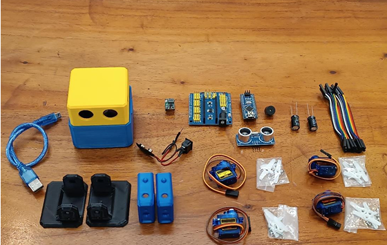
> *Componentes utilizados na montagem do Otto Starter.*

### 6.2 Instalação dos servos das pernas no corpo

Os dois primeiros servos formam as articulações das pernas:

1. Coloque cada servo na parte interna do corpo.
2. Observe a orientação do eixo de saída e dos cabos antes de parafusar.
3. Mantenha os cabos voltados para o interior, sem prensá-los entre o servo e a peça impressa.
4. Prenda cada servo pelos pontos de fixação usando os parafusos maiores.
5. Aperte até eliminar a folga, sem deformar o plástico impresso.

Não fixe ainda as pernas de forma irreversível. Os eixos deverão ser centralizados durante a calibração.

> 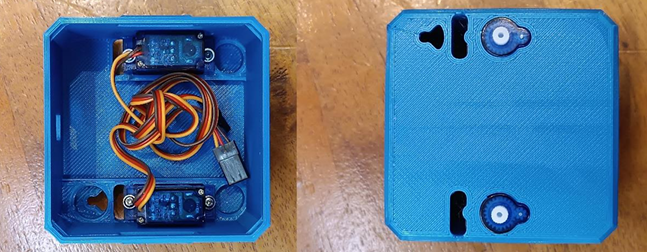
> *Posicionamento dos servos das pernas no interior do corpo.*

### 6.3 Preparação das pernas e das cruzetas

As pernas impressas recebem os acoplamentos em formato de cruzeta:

1. Teste a cruzeta no alojamento interno da perna.
2. Se a peça impressa exigir, reduza somente as extremidades que impedem o encaixe, usando alicate de corte.
3. Faça cortes pequenos e simétricos; uma cruzeta excessivamente reduzida pode perder rigidez.
4. Posicione a cruzeta dentro da perna e alinhe seu centro ao furo da peça.
5. Prenda a cruzeta à peça impressa conforme a geometria do modelo, sem obstruir o encaixe no eixo do servo.
6. Repita o processo na segunda perna.

Use óculos de proteção ao cortar plástico. Não corte o cubo central estriado da cruzeta.

> 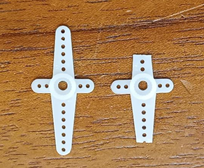  
> *Preparação da cruzeta de servo utilizado nas pernas.*


> 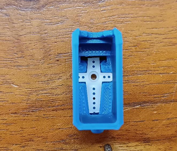 
> *Encaixe das cruzetas dos servos instalados na perna.*

### 6.4 Encaixe das pernas no corpo

1. Posicione cada perna no lado correspondente do corpo.
2. Encaixe a cruzeta no eixo do servo procurando deixar a perna o mais reta possível.
3. Verifique se ambas possuem liberdade de movimento e não raspam no corpo.
4. Coloque o parafuso central do acoplamento sem aplicar torque excessivo.
5. Se a calibração ainda não foi realizada, mantenha o conjunto acessível para reposicionar a cruzeta um ou mais dentes, se necessário.

> 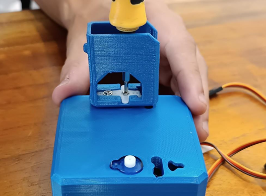
> *Encaixe das cruzetas dos servos instalados na perna.*


### 6.5 Instalação dos servos dos pés

Os dois servos restantes são instalados dentro das pernas:

1. Encaixe um servo em cada perna, observando a orientação do eixo e do cabo.
2. Alinhe os pontos de fixação e use os parafusos maiores restantes.
3. Passe os cabos pelas fendas inferiores das pernas e pelos furos do corpo.
4. Deixe uma pequena folga de cabo para permitir o movimento completo da articulação.
5. Confirme manualmente que o cabo não será puxado, esmagado ou enrolado pelo movimento.

> 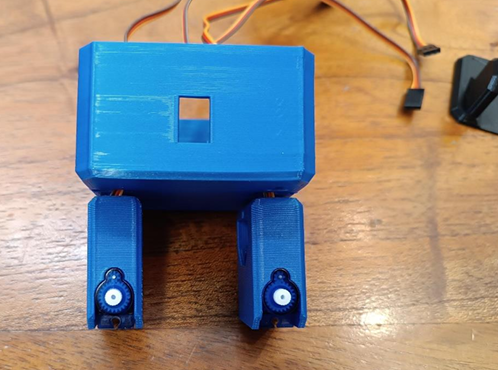  
> 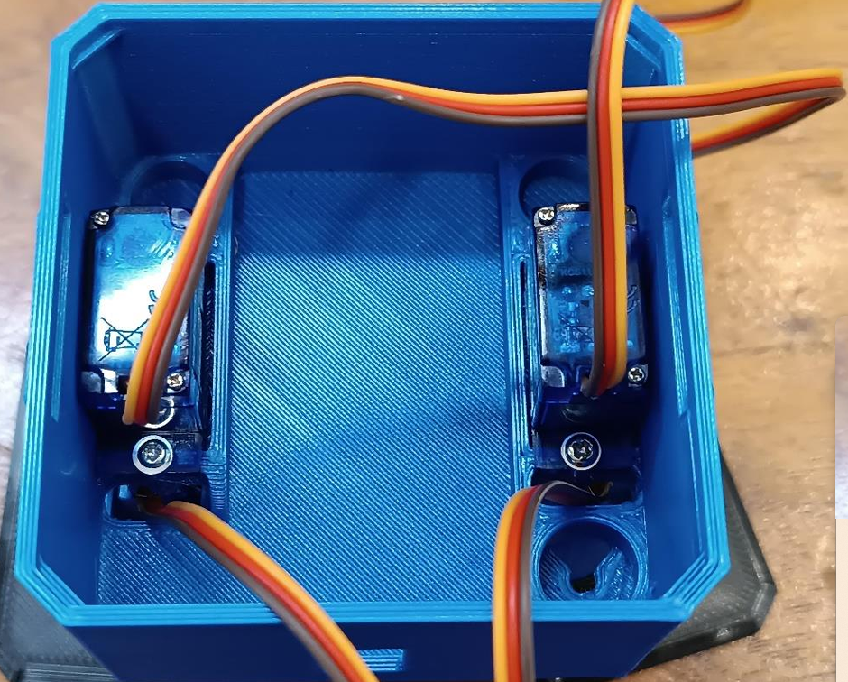
> *Instalação dos servos dos pés e passagem dos cabos.*

### 6.6 Montagem dos pés

Cada pé utiliza um dos acoplamentos pequenos fornecidos com o servo:

1. Posicione o acoplamento no alojamento interno do pé.
2. Alinhe o pé simultaneamente com o eixo estriado do servo e com o apoio mecânico existente no lado oposto da perna.
3. Flexione apenas o necessário as laterais da peça; não force o eixo do servo.
4. Encaixe o pé aproximadamente paralelo à bancada.
5. Fixe o acoplamento ao eixo com o parafuso pequeno.
6. Repita no outro lado e compare a simetria dos dois pés.


O alinhamento final será obtido pela calibração. Se um pé ficar muito inclinado, reposicione mecanicamente o acoplamento antes de tentar compensar tudo por software.

> 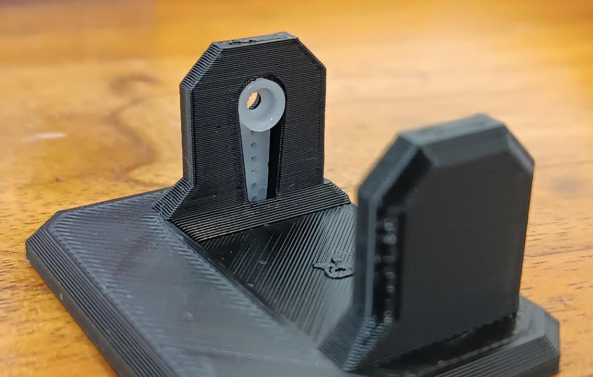 
> *Montagem dos pés nas articulações inferiores.*

>  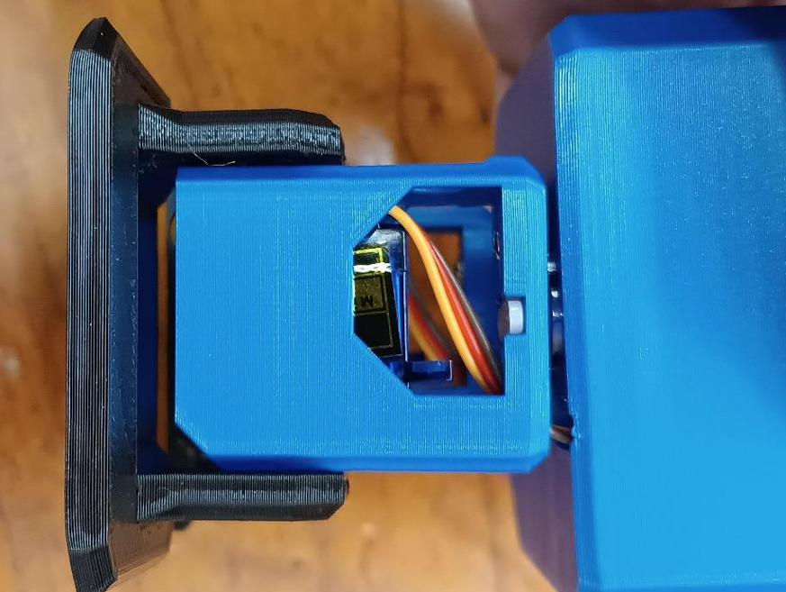 
> 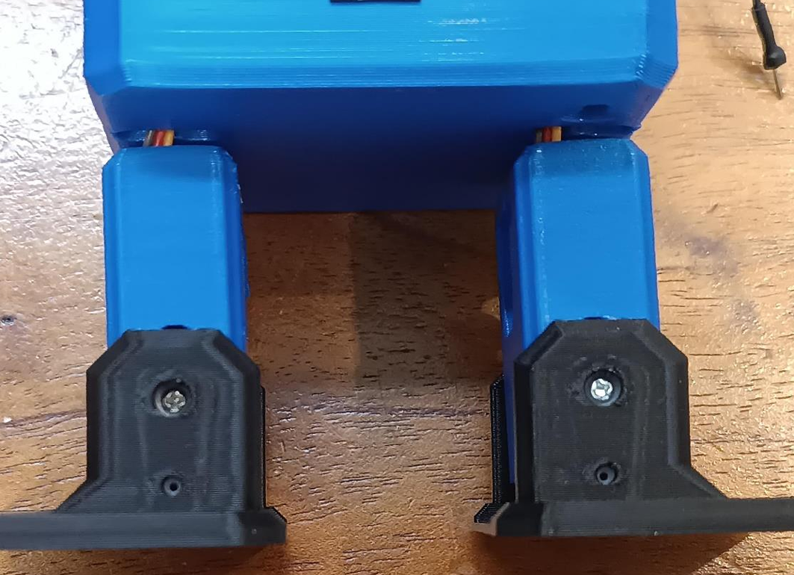
> 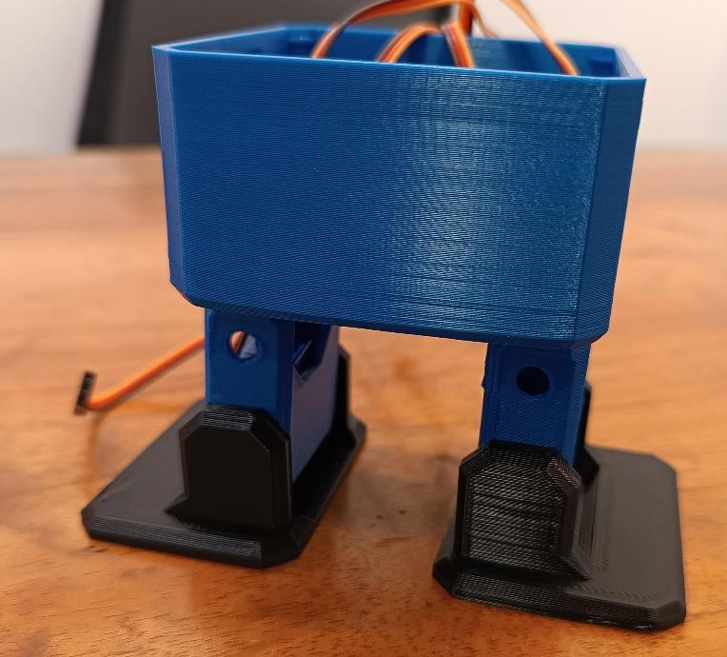
> *Corpo, pernas e pés após a montagem estrutural.*

### 6.7 Montagem da cabeça

1. Insira o HC-SR04 na abertura frontal da cabeça, formando os olhos do Otto.
2. Os dois transdutores devem ficar livres e voltados para a frente.
3. Não pressione nem aplique cola sobre as membranas metálicas.
4. Posicione o Nano e a shield na base interna da cabeça.
5. Alinhe a porta USB e o conector de alimentação às aberturas da peça impressa.
6. Fixe o conjunto com fita dupla face VHB ou pequena quantidade de cola quente.
7. Mantenha o botão RESET, a porta USB e os conectores acessíveis.

Não feche a cabeça nesta etapa. A fiação e os testes devem ser concluídos primeiro.

> 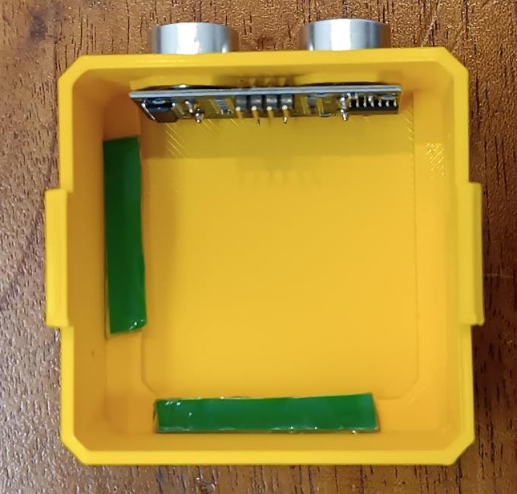 
> 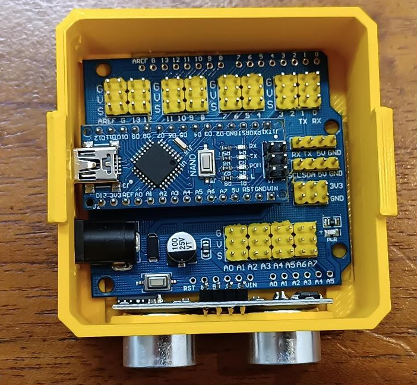 
> *Instalação do sensor ultrassônico e da eletrônica na cabeça.*

### 6.8 Identificação das articulações

Para evitar inversões durante a conexão, coloque o Otto voltado para a frente e adote sempre o ponto de vista do robô:

| Articulação | Pino |
|---|---:|
| Perna esquerda | D2 |
| Perna direita | D3 |
| Pé esquerdo | D4 |
| Pé direito | D5 |

Dica: Etiquete temporariamente cada conector de servo antes de ligá-lo à shield.

> 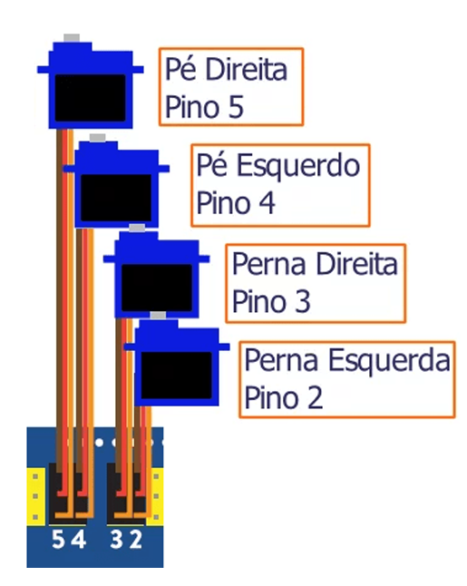
> 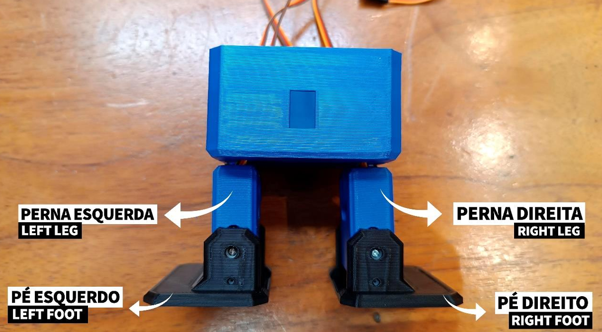
> *Referência adotada para identificação das articulações pelos servos.*

### 6.9 Ligações elétricas

#### 6.9.1 Servos

Conecte o fio de sinal de cada servo ao pino indicado. A alimentação dos servos deve seguir o circuito de potência da montagem, mantendo GND comum com o Nano.

| Articulação | Sinal |
|---|---:|
| Perna esquerda | D2 |
| Perna direita | D3 |
| Pé esquerdo | D4 |
| Pé direito | D5 |

Não use D0 ou D1 para servos. Esses pinos são RX e TX da porta serial USB do Nano; usá-los como sinal de servo provoca movimentos ao abrir o Monitor Serial e pode atrapalhar a gravação do programa.

#### 6.9.2 Sensor HC-SR04

| HC-SR04 | Arduino Nano |
|---|---:|
| VCC | 5 V |
| GND | GND |
| TRIG | D8 |
| ECHO | D9 |

O sensor deve ficar voltado para a frente, sem peças do corpo do Otto bloqueando os transdutores. Os modos autônomos dependem totalmente dessa ligação.

#### 6.9.3 Buzzer

| Buzzer | Arduino Nano |
|---|---:|
| Sinal | D13 |
| GND | GND |

O tutorial mantém D13, conforme o exemplo oficial do Otto. Para reproduzir as melodias da OttoDIYLib, prefira um buzzer passivo ou piezoelétrico; um buzzer ativo normalmente produz apenas seu tom fixo.

#### 6.9.4 Módulo HM-10

A comunicação serial é cruzada:

| HM-10 | Arduino Nano | Motivo |
|---|---:|---|
| TXD | D10 | D10 é o RX do `SoftwareSerial` |
| RXD | D11 | D11 é o TX do `SoftwareSerial` |
| GND | GND | Referência elétrica comum |
| VCC | Conforme a placa do módulo | Depende de haver regulador na placa |

O construtor usado no código é:

```cpp
SoftwareSerial bluetooth(BLE_RX_PIN, BLE_TX_PIN);
```

Por isso, a ordem é `RX, TX`: D10 recebe e D11 transmite.

O chip HM-10 trabalha com lógica de 3,3 V. Algumas placas adaptadoras aceitam alimentação de 5 V no pino VCC porque possuem regulador, mas isso não significa necessariamente que o pino RXD aceite sinal lógico de 5 V. Na dúvida:

- ligue o TXD de 3,3 V do HM-10 diretamente ao D10 do Nano;
- reduza o sinal de 5 V que sai do D11 antes de chegar ao RXD do HM-10;
- um divisor com 1 kΩ entre D11 e RXD e 2 kΩ entre RXD e GND produz aproximadamente 3,3 V;
- alimente o módulo apenas com a tensão indicada na própria placa ou em seu datasheet.

Os pinos `STATE` e `EN/KEY` não são necessários para o uso normal com o Web App.

> 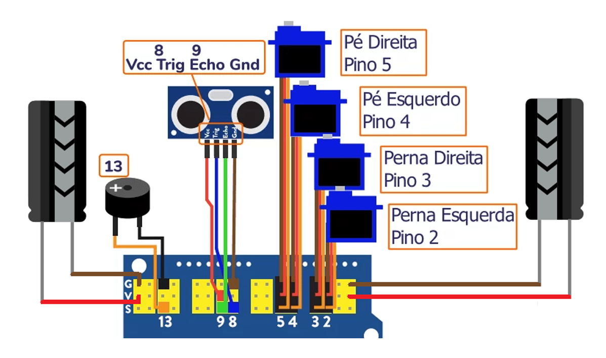
> *Ligações elétricas do Otto Starter com a pinagem oficial.*

### 6.10 Alimentação, organização interna e fechamento

Se o kit utilizar bateria, chave gangorra e regulador de tensão:

1. Faça toda a montagem com a bateria desconectada.
2. Identifique corretamente entrada e saída do regulador, incluindo `IN+`, `IN-`, `OUT+` e `OUT-`.
3. Antes de conectar o Nano ou os servos, ajuste e confira a saída com um multímetro.
4. Nunca aplique 9 V diretamente ao barramento de 5 V ou aos servos.
5. Passe a chave pela abertura traseira e deixe seus terminais isolados.
6. Fixe buzzer, HM-10 e demais componentes sem cobrir a antena do BLE.
7. Mantenha fios afastados dos eixos e articulações.
8. Prenda os cabos sem tensioná-los e deixe a USB acessível.
9. Somente acomode a bateria e feche a cabeça após concluir calibração, upload e testes.

Uma bateria retangular de 9 V pode não fornecer adequadamente os picos de corrente de quatro servos. Se ocorrerem reinicializações, tremores ou desconexões, use uma fonte ou conjunto de baterias regulado e capaz de fornecer a corrente necessária.


## 7. Preparação do Arduino IDE

### 7.1 Instalar o Arduino IDE

Baixe o programa na [página oficial do Arduino](https://www.arduino.cc/en/software) e conclua a instalação.

### 7.2 Instalar o pacote da placa

No Arduino IDE:

1. Abra **Ferramentas → Placa → Gerenciador de Placas**.
2. Procure por **Arduino AVR Boards**.
3. Instale o pacote oficial.

### 7.3 Instalar a OttoDIYLib

O procedimento indicado no repositório oficial é baixar a biblioteca e usar **Sketch/Programa → Incluir Biblioteca → Adicionar Biblioteca .ZIP**. Depois da instalação, `Otto.h` deve aparecer entre as bibliotecas disponíveis. Consulte as [instruções da OttoDIYLib](https://github.com/OttoDIY/OttoDIYLib#installation).

`SoftwareSerial` já faz parte do ambiente das placas AVR e não precisa ser instalada separadamente.

## 8. Gravação do firmware no Nano

1. Abra o arquivo `.ino` do firmware.
2. Conecte o Nano diretamente ao computador com um cabo USB de dados.
3. Feche o Monitor Serial e o Plotter Serial.
4. Selecione **Ferramentas → Placa → Arduino AVR Boards → Arduino Nano**.
5. Selecione a porta COM que aparece quando o Nano é conectado.
6. Em **Processador**, tente primeiro **ATmega328P**.
7. Se houver `programmer is not responding` ou `not in sync`, tente **ATmega328P (Old Bootloader)**.
8. Deixe a alimentação externa dos servos desligada durante a gravação.
9. Clique em **Carregar**, e não apenas em Verificar.
10. Aguarde a mensagem de conclusão do upload.

A seleção do processador e do bootloader do Nano é explicada no [suporte oficial do Arduino](https://support.arduino.cc/hc/en-us/articles/4401874304274-Select-the-right-processor-for-Arduino-Nano). O procedimento geral de gravação está na [documentação de upload do Arduino IDE](https://support.arduino.cc/hc/en-us/articles/4733418441116-Upload-a-sketch-in-Arduino-IDE).

Durante a compilação, o código emite uma identificação semelhante a:

```text
COMPILANDO: OTTO STARTER BLE - PINAGEM OFICIAL - BLE D10/D11
```

Essa mensagem ajuda a confirmar que o arquivo correto foi compilado.

## 9. Verificação inicial pelo Monitor Serial

Depois do upload:

1. Abra o Monitor Serial.
2. Selecione **9600 baud**.
3. Pressione RESET no Nano.
4. O Otto deve ir para a posição inicial e emitir o som de conexão.
5. A saída esperada é:

```text
OTTO STARTER BLE - PINAGEM OFICIAL
Servos: perna E D2 | perna D D3 | pe E D4 | pe D D5
BLE: modulo TXD -> D10 | modulo RXD <- D11 | 9600 baud
Buzzer: D13 | Trims: EEPROM habilitada
```

Se aparecer o nome de outro firmware, outro arquivo ou outra placa foi gravado.

## 10. Calibração dos servos

### 10.1 O que é calibração

Mesmo recebendo o comando de 90°, dois servos podem parar em posições físicas ligeiramente diferentes. A biblioteca chama a correção individual de cada servo de `trim`.

O objetivo é deixar:

- as duas pernas alinhadas;
- os dois pés paralelos à superfície;
- o corpo equilibrado na posição `home`.

### 10.2 Reutilização da calibração existente

O último parâmetro booleano relevante na inicialização é `true`:

```cpp
ottobot.init(
  LEFT_LEG_PIN,
  RIGHT_LEG_PIN,
  LEFT_FOOT_PIN,
  RIGHT_FOOT_PIN,
  true,
  BUZZER_PIN
);
```

Esse `true` faz a OttoDIYLib ler os quatro trims gravados nos endereços iniciais da EEPROM. Assim, depois de calibrar com o programa de calibração e carregar o firmware BLE, os ajustes permanecem.

### 10.3 Calibração pelo Web App

O Web App envia os quatro ângulos absolutos neste formato:

```text
C90a90b90c90d
```

A ordem é sempre:

1. perna esquerda;
2. perna direita;
3. pé esquerdo;
4. pé direito.

No firmware, cada valor é convertido em trim subtraindo 90. Por exemplo, um valor 94 vira trim `+4`; um valor 87 vira trim `-3`.

Procedimento:

1. Coloque o Otto suspenso ou apoiado de forma que os servos não sejam forçados.
2. Conecte o Web App conforme a próxima seção.
3. Abra a tela de calibração do Otto Starter.
4. Ajuste uma articulação por vez.
5. Use **Walk test** para observar a marcha.
6. Volte e refine os valores se necessário.
7. Pressione **Save calibration**.

O botão de salvar envia:

```text
save_calibration
```

O firmware chama `ottobot.saveTrimsOnEEPROM()` e emite um som curto. Sem esse comando, o ajuste feito pelo Web App vale apenas até reiniciar o Nano.

> Se o Otto já foi calibrado corretamente pelo programa serial, não é necessário refazer a calibração no Web App.

## 11. Conexão pelo Otto Web App

O projeto oficial recomenda o Google Chrome em computadores e Android; no iPhone e iPad, recomenda o navegador Bluefy. O navegador usa Web Bluetooth, que permite ao site solicitar acesso a um dispositivo BLE próximo. Consulte o [repositório do Otto Web App](https://github.com/OttoDIY/OttoWebAppControl) e a [documentação do Web Bluetooth no Chrome](https://developer.chrome.com/docs/capabilities/bluetooth/).

### 11.1 Antes de conectar

Confirme que:

- o Bluetooth do computador está ativado;
- o computador possui suporte a Bluetooth Low Energy;
- o HM-10 está energizado;
- o LED do módulo está piscando ou indicando modo de espera;
- o módulo não está conectado a outro celular ou computador;
- o Web App foi aberto por HTTPS;
- o firmware BLE já está no Nano.

### 11.2 Procedimento

1. Abra o Google Chrome.
2. Acesse [Otto Web App Control](https://ottodiy.github.io/OttoWebAppControl/).
3. Selecione **Otto Starter**.
4. Clique em **Connect**.
5. Na janela aberta pelo próprio Chrome, selecione `HMSoft`, `HM-10`, `BT05`, `CC41-A` ou o nome apresentado pelo módulo.
6. Autorize a conexão.
7. Aguarde a indicação de conectado.

Não é obrigatório adicionar previamente o HM-10 em **Configurações → Bluetooth e dispositivos** do Windows. A seleção importante é a janela criada pelo próprio Chrome.

### 11.3 Requisito GATT do módulo

Para esse Web App, o módulo precisa expor:

| Elemento BLE | Requisito |
|---|---|
| Serviço GATT | `FFE0` |
| Característica serial | normalmente `FFE1` |
| Propriedade necessária | `Write` ou `Write Without Response` |
| Propriedade desejável | `Notify`, para retornar dados do sensor |

O firmware do Nano não cria o serviço `FFE0`. Esse serviço pertence ao firmware interno do HM-10.

Se o navegador mostrar:

```text
The device was paired but the service FFE0 is empty, so no command can be sent.
```

o Chrome encontrou o dispositivo, mas não encontrou uma característica utilizável dentro de `FFE0`. Isso ocorre antes de qualquer comando chegar ao Nano. Nesse caso:

1. desligue outros aparelhos que possam estar conectados ao HM-10;
2. remova a permissão Bluetooth do site e tente novamente;
3. desligue e religue o módulo;
4. use o aplicativo nRF Connect em um celular para inspecionar os serviços;
5. confirme se existe `FFE0` e, dentro dele, uma característica gravável, normalmente `FFE1`.

Se `FFE0` estiver realmente vazio ou não existir, o módulo pode ser um clone com firmware GATT incompatível. Alterar os pinos dos servos ou o sketch do Nano não corrige esse problema.

## 12. Primeiro teste seguro

Faça os testes na seguinte ordem, com o Otto suspenso:

1. Conecte pelo Web App.
2. Pressione **Stop**.
3. Selecione uma velocidade intermediária, como índice 2.
4. Execute um gesto curto, como **Happy**.
5. Teste um único passo para frente.
6. Teste um passo para trás.
7. Teste giro à esquerda e à direita.
8. Somente depois coloque o Otto no chão.
9. Antes de usar Avoid ou Jedi, confirme que a leitura do ultrassônico muda quando a mão se aproxima e se afasta.

O Monitor Serial permanece útil durante o teste. Cada comando recebido pelo HM-10 deve aparecer assim:

```text
BLE: forward 2
BLE: stop
BLE: happy
```

## 13. Velocidades

O Web App envia um índice de 0 a 5. O índice seleciona o período do movimento:

| Índice | Período usado | Efeito aproximado |
|---:|---:|---|
| 0 | 3000 ms | Mais lento |
| 1 | 2000 ms | Lento |
| 2 | 1000 ms | Intermediário |
| 3 | 750 ms | Rápido |
| 4 | 500 ms | Muito rápido |
| 5 | 250 ms | Máxima rapidez configurada |

Um número menor de milissegundos produz um ciclo mais rápido. Para os primeiros testes, use 1 ou 2. As velocidades mais altas exigem boa alimentação, montagem firme e calibração correta.

## 14. Comandos reconhecidos

### 14.1 Movimento contínuo

| Ação no Web App | Texto enviado | Ação no firmware |
|---|---|---|
| Frente | `forward n` | Caminha para frente |
| Trás | `backward n` | Caminha para trás |
| Direita | `right n` | Gira para a direita |
| Esquerda | `left n` | Gira para a esquerda |
| Parar | `stop` | Cancela o modo e chama `home()` |

`n` é o índice de velocidade entre 0 e 5. O Web App acrescenta `\n` ao fim de cada comando.

### 14.2 Gestos

| Comando | Gesto da OttoDIYLib |
|---|---|
| `happy` | `OttoSuperHappy` |
| `victory` | `OttoVictory` |
| `sad` | `OttoSad` |
| `sleeping` | `OttoSleeping` |
| `confused` | `OttoConfused` |
| `fail` | `OttoFail` |
| `fart` | `OttoFart` |

Ao receber um gesto, o firmware interrompe o movimento contínuo e executa a animação. Se a versão do Web App apresentar um botão que envie `wrong`, esse comando não está implementado neste firmware e será ignorado.

### 14.3 Sensor e modos autônomos

| Ação | Comando | Resultado |
|---|---|---|
| Ler distância | `ultrasound` | Retorna a distância em centímetros |
| Desviar | `avoidance n` | Ativa o modo Avoid |
| Jedi | `force n` | Ativa o modo de aproximação/afastamento |
| Alterar limiar | número entre 2 e 200 | Muda o limiar ultrassônico |

### 14.4 Calibração

| Ação | Comando |
|---|---|
| Atualizar quatro ajustes | `C...a...b...c...d` |
| Testar marcha | `walk_test` |
| Gravar na EEPROM | `save_calibration` |

Esses formatos correspondem aos comandos emitidos pelo [código do Web App](https://github.com/OttoDIY/OttoWebAppControl/blob/main/js/commands.js).

## 15. Sensor ultrassônico e modos Avoid/Jedi

### 15.1 Como a distância é medida

A função gera um pulso de 10 µs no TRIG e mede por quanto tempo o ECHO permanece em nível alto:

```cpp
const unsigned long duration = pulseIn(
  ULTRASONIC_ECHO_PIN,
  HIGH,
  30000UL
);
```

Depois, converte o tempo de ida e volta do som em centímetros:

```cpp
return static_cast<long>(duration / 58UL);
```

O limite de 30.000 µs evita que o programa espere indefinidamente. Quando não há eco, a função retorna `-1`.

### 15.2 Validação obrigatória antes dos modos autônomos

Antes de ativar Avoid ou Jedi:

1. peça a leitura `ultrasound` pelo Web App;
2. coloque a mão aproximadamente a 10 cm;
3. afaste para 20 cm e depois 40 cm;
4. confirme que os valores mudam de forma coerente;
5. se a leitura não variar, não teste os modos autônomos no chão.

Se os movimentos manuais funcionam, mas Avoid e Jedi não funcionam, o primeiro ponto a verificar é o conjunto HC-SR04, TRIG D8, ECHO D9, alimentação e GND — não os pinos dos servos.

### 15.3 Avoid

Com o limiar padrão de 15 cm:

- distância válida maior que 15 cm: avança um ciclo;
- obstáculo entre 1 e 15 cm: executa `OttoConfused`, recua dois passos e gira quatro ciclos para a esquerda;
- sem eco (`-1`): nesta versão, a condição de obstáculo é falsa e o robô avança.

Esse último comportamento é uma limitação importante: sensor desconectado ou sem eco pode ser interpretado como caminho livre. Por isso, valide o sensor antes de colocar o Otto no chão.

### 15.4 Jedi (`force`)

Jedi não é uma dança. É um modo reativo que usa a mão ou outro objeto como referência:

- sem eco ou distância igual/superior a 30 cm: fica em `home`;
- distância menor ou igual ao limiar configurado: recua;
- distância maior que o limiar e menor que 30 cm: avança.

Com o limiar padrão de 15 cm:

| Distância | Comportamento |
|---:|---|
| Sem eco | Para |
| Até 15 cm | Recua |
| 16 a 29 cm | Avança |
| 30 cm ou mais | Para |

Esta implementação não possui uma faixa neutra intermediária. Se o Jedi somente recuar, o sensor provavelmente está informando continuamente uma distância menor ou igual ao limiar. Confira primeiro a leitura retornada pelo ultrassônico.

<div style="text-align: center">
  
  <br>
  <em>Robô Otto Bípede: estrutura bípede com 4 servomotores</em>
</div>

## 16. Explicação do código

### 16.1 Bibliotecas

```cpp
#include <Arduino.h>
#include <Otto.h>
#include <SoftwareSerial.h>
#include <string.h>
```

- `Arduino.h`: funções básicas do Arduino, tipos e acesso aos pinos;
- `Otto.h`: movimentos, gestos, sons, servos e calibração;
- `SoftwareSerial.h`: cria uma segunda porta serial em D10 e D11;
- `string.h`: oferece `strncmp`, `strlen` e `strrchr` para interpretar comandos.

### 16.2 Identificação do firmware

O `#pragma message` aparece durante a compilação. `FIRMWARE_VERSION` aparece no Monitor Serial após a inicialização. As duas identificações ajudam a detectar quando o Arduino IDE abriu ou gravou uma versão antiga.

### 16.3 Constantes de pinagem

O exemplo oficial apresenta a pinagem com diretivas `#define`:

```cpp
#define LeftLeg 2
#define RightLeg 3
#define LeftFoot 4
#define RightFoot 5
#define Buzzer 13
#define Trigger 8
#define Echo 9
```

No firmware deste tutorial, a mesma pinagem pode ser expressa com constantes tipadas:

```cpp
constexpr uint8_t LEFT_LEG_PIN = 2;
constexpr uint8_t RIGHT_LEG_PIN = 3;
constexpr uint8_t LEFT_FOOT_PIN = 4;
constexpr uint8_t RIGHT_FOOT_PIN = 5;
constexpr uint8_t ULTRASONIC_TRIG_PIN = 8;
constexpr uint8_t ULTRASONIC_ECHO_PIN = 9;
constexpr uint8_t BUZZER_PIN = 13;
```

A ordem acompanha a assinatura da biblioteca:

```cpp
init(pernaE, pernaD, peE, peD, carregarCalibracao, buzzer)
```

Alterar a ordem faz um comando de perna atuar em um pé ou no lado oposto.

### 16.4 Tabela de velocidades

```cpp
const uint16_t MOVE_SPEED_MS[] = {3000, 2000, 1000, 750, 500, 250};
```

O programa guarda apenas o índice selecionado. Antes de mover, consulta `MOVE_SPEED_MS[speedIndex]`.

### 16.5 Estado de movimento

O `enum Motion` representa o modo atual:

```cpp
MOTION_STOP
MOTION_FORWARD
MOTION_BACKWARD
MOTION_LEFT
MOTION_RIGHT
MOTION_AVOIDANCE
MOTION_FORCE
```

Isso permite que um único comando, como `forward 2`, deixe o robô caminhando. A cada repetição de `loop()`, `runCurrentMotion()` executa mais um ciclo do modo selecionado.

### 16.6 Objetos principais

```cpp
Otto ottobot;
SoftwareSerial bluetooth(BLE_RX_PIN, BLE_TX_PIN);
```

`ottobot` controla servos, buzzer, marcha e gestos. `bluetooth` recebe e envia bytes pela UART do HM-10.

### 16.7 Leitura do ultrassônico

`readUltrasonicDistanceCm()` produz o pulso de disparo, mede o ECHO, trata ausência de resposta e converte o resultado em centímetros.

### 16.8 Reconhecimento de prefixos

```cpp
bool startsWith(const char *text, const char *prefix)
```

Essa função permite reconhecer tanto `forward` quanto `forward 2`. O texto é comparado apenas pelo tamanho do prefixo.

### 16.9 Seleção da velocidade

`updateSpeedFromCommand()` procura o último espaço do comando e converte o texto que vem depois dele em número. O valor só é aceito se estiver entre 0 e 5.

### 16.10 Decodificação da calibração

`readCalibrationValue()` usa `strtol()` para ler cada número e exige os terminadores `a`, `b`, `c` e `d`. `applyCalibrationCommand()` rejeita comandos incompletos ou ângulos fora de 0° a 180°.

Depois, transforma ângulos absolutos em trims:

```cpp
ottobot.setTrims(
  leftLeg - 90,
  rightLeg - 90,
  leftFoot - 90,
  rightFoot - 90
);
```

O vetor `{90, 90, 90, 90}` manda todas as articulações para a posição neutra já corrigida pelos trims.

### 16.11 Tratamento central dos comandos

`handleBluetoothCommand()` é o roteador do firmware. Ele:

- muda o estado para os movimentos contínuos;
- executa `home()` ao parar;
- responde à leitura do ultrassônico;
- ativa Avoid e Jedi;
- toca os gestos;
- aplica e grava a calibração;
- aceita um novo limiar do ultrassônico.

### 16.12 Recepção serial

`checkBluetooth()` espera dados no HM-10 e lê até encontrar `\n`:

```cpp
bluetooth.readBytesUntil('\n', commandBuffer, COMMAND_BUFFER_SIZE - 1);
```

O byte final é substituído por `\0`, transformando o buffer em uma string C válida. Se houver `\r`, ele também é retirado. Em seguida, o comando é mostrado no Monitor Serial e encaminhado ao roteador.

O timeout de 100 ms impede uma espera longa por um comando incompleto. Por isso, quem enviar comandos fora do Web App também deve terminar cada texto com nova linha.

### 16.13 Execução dos movimentos

`runCurrentMotion()` chama:

- `walk(..., FORWARD)` para frente;
- `walk(..., BACKWARD)` para trás;
- `turn(..., LEFT)` para esquerda;
- `turn(..., RIGHT)` para direita;
- `runAvoidance()` para Avoid;
- `runForceMode()` para Jedi.

As rotinas da OttoDIYLib são bloqueantes durante cada ciclo. Assim, o comando Stop é processado quando o ciclo atual termina; ele não interrompe um passo no meio. Esse é outro motivo para fazer o primeiro teste com o robô suspenso.

### 16.14 `setup()`

O `setup()`:

1. inicia a porta USB em 9600 baud;
2. inicia a UART do HM-10 em 9600 baud;
3. define o timeout de recepção;
4. configura TRIG e ECHO;
5. inicializa o Otto com a pinagem oficial `2, 3, 4, 5`;
6. carrega os trims da EEPROM;
7. envia o robô para `home`;
8. toca o som de conexão;
9. mostra a identificação e as ligações no Monitor Serial.

### 16.15 `loop()`

```cpp
void loop() {
  checkBluetooth();
  runCurrentMotion();
}
```

Primeiro o Nano verifica se chegou um novo comando; depois executa um ciclo do estado atual. Essa estrutura simples funciona como uma pequena máquina de estados.

## 17. Diagnóstico sistemático

Não troque vários fios ou várias constantes ao mesmo tempo. Teste as camadas nesta ordem:

1. upload do Nano;
2. identificação no Monitor Serial;
3. posição `home` e buzzer;
4. conexão BLE/GATT;
5. chegada do texto `BLE: ...` ao Nano;
6. movimentos manuais;
7. leitura do HC-SR04;
8. Avoid;
9. Jedi;
10. calibração e gravação na EEPROM.

| Sintoma | Causa provável | Verificação |
|---|---|---|
| `Otto.h: No such file or directory` | OttoDIYLib ausente | Instalar a biblioteca ZIP oficial |
| `programmer is not responding` | Porta, bootloader ou porta ocupada | Fechar Monitor Serial, conferir COM e testar Old Bootloader |
| Aparece nome de firmware antigo | Arquivo ou placa errada | Conferir aba aberta, mensagem de compilação e COM |
| HM-10 não aparece no Windows | Pareamento do Windows não é o caminho principal | Procurar pelo seletor Bluetooth do Chrome |
| HMSoft aparece, mas `FFE0 is empty` | Serviço GATT incompatível ou sem característica gravável | Inspecionar FFE0/FFE1 com nRF Connect |
| Web App conecta, mas não aparece `BLE:` | UART não chegou ao Nano | Conferir TXD→D10, RXD←D11, GND e 9600 baud |
| `BLE:` aparece, mas não há movimento | Alimentação ou ligação dos servos | Conferir fonte, GND comum e D2/D3/D4/D5 |
| Um comando move a articulação errada | Servo fisicamente ligado ao pino errado | Mapear o fio, sem reinterpretar esquerda/direita |
| Nano reinicia ou BLE desconecta durante a marcha | Queda de tensão ou ruído dos servos | Melhorar fonte, cabos e desacoplamento; manter GND comum |
| Controle manual funciona, Avoid/Jedi não | HC-SR04 sem leitura válida | Conferir VCC, GND, TRIG D8, ECHO D9 e leitura de distância |
| Jedi só anda para trás | Distância medida sempre abaixo do limiar | Observar valor do sensor e retirar obstruções diante dele |
| Avoid avança mesmo sem sensor | Ausência de eco tratada como caminho livre nesta versão | Corrigir o sensor antes de usar o modo |
| Botão `wrong` não faz nada | Comando não implementado | Usar apenas os gestos listados neste tutorial |

## 18. Checklist final de validação

- [ ] Perna esquerda em D2.
- [ ] Perna direita em D3.
- [ ] Pé esquerdo em D4.
- [ ] Pé direito em D5.
- [ ] Buzzer em D13.
- [ ] HM-10 TXD ligado a D10.
- [ ] HM-10 RXD ligado a D11 com nível lógico seguro.
- [ ] HC-SR04 TRIG em D8 e ECHO em D9.
- [ ] Todos os GNDs interligados.
- [ ] Fonte dos servos adequada e regulada.
- [ ] Firmware correto identificado no Monitor Serial.
- [ ] HM-10 com serviço FFE0 e característica gravável.
- [ ] Comandos aparecem como `BLE: ...` no Monitor Serial.
- [ ] Frente, trás, esquerda, direita e Stop funcionam suspensos.
- [ ] Leitura ultrassônica muda com a distância.
- [ ] Avoid e Jedi testados somente após validar o sensor.
- [ ] Calibração gravada e preservada após RESET.

## 19. Referências

- Eletrogate. *Apostila Kit Robô Otto DIY*. Material didático utilizado como referência para a sequência de montagem mecânica.
- [Otto Web App Control — repositório oficial](https://github.com/OttoDIY/OttoWebAppControl)
- [Firmware oficial Otto Starter BLE](https://github.com/OttoDIY/OttoWebAppControl/blob/main/OttoS_BLE.ino)
- [Comandos enviados pelo Web App](https://github.com/OttoDIY/OttoWebAppControl/blob/main/js/commands.js)
- [OttoDIYLib — biblioteca oficial](https://github.com/OttoDIY/OttoDIYLib)
- [Exemplo oficial de calibração](https://github.com/OttoDIY/OttoDIYLib/blob/master/examples/Otto_CalibrationWalk/Otto_CalibrationWalk.ino)
- [SoftwareSerial — documentação Arduino](https://docs.arduino.cc/tutorials/communication/TwoPortReceive)
- [Web Bluetooth — Chrome for Developers](https://developer.chrome.com/docs/capabilities/bluetooth/)
- [Seleção do processador do Arduino Nano](https://support.arduino.cc/hc/en-us/articles/4401874304274-Select-the-right-processor-for-Arduino-Nano)

## 20. Licença e atribuição

O firmware é baseado no projeto aberto OttoWebAppControl e utiliza a OttoDIYLib. Ao redistribuir o código derivado, mantenha os créditos e a identificação `SPDX-License-Identifier: GPL-3.0-or-later` presentes no arquivo-fonte.
